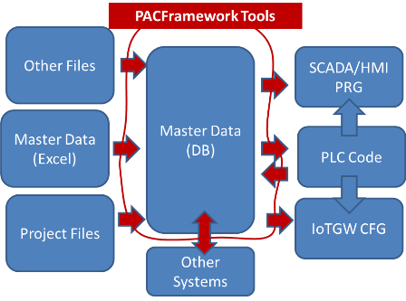

# PACFramework tools

PACFramework tools (**PFwTools**) - це програмні утиліти під вільною ліцензією [MIT](https://github.com/pupenasan/pacframework-tools/blob/main/LICENSE.txt) для автоматизації процесів розроблення на базі [PACFramework](https://github.com/pupenasan/PACFramework) та [PACFramework IoT Gateway](https://github.com/pupenasan/PACFrameworkIoTGateway). 

**Увага! Утиліти призначені виключно сумісно з ресурсами розробленими відповідно до правил каркасу PACFramework.** Тим не менше можна користуватися PACFramework без утиліт PFwTools. 

Утиліти призначені для: 

- автоматизації розгортання на ПЛК з проектних майстерданих
  - базовий вихідний формат - xlsx, можливі інші формати за необхідності (в плані інтеграція з Eplan electric)
  - проміжний формат БД для майстерданих JSON 
  - проводиться попередня перевірка коректності (правила найменування, лінки об'єктів, адресація-тощо )
- реверсне генерування проектних даних з ПЛК в JSON
  - для розгортання в SCADA/HMI та інших проектів
  - для розгортання в PACFramework IoTGateway
  - для перенесення в інші формати за необхідності 




Утиліти є консольними (командного рядку) і необхідно встановлювати на робочу станцію, де знаходиться інше необхідне інженерне ПЗ. Вони переважно розроблені з використанням Node.JS з деякими скриптами на VBS.

## Робота з PFWTools

### Інсталювання

Передбачається що утиліти використовуватимуться на ОС Windows 10. Для використання утиліт необхідно:

- завантажити останню версію Node.JS з сайту <https://nodejs.org/uk/> (LTS версію).

- створити директорію, куди будуть інтсталюватися застосунок та бібліотеки, наприклад `C:\pacfwtools`:

  ```
  md C:\pacfwtools
  ```

- з командного вікна перейти в директорію застосунку запустити команду для інсталювання застосунку, який поставить останню версію pacframework-tools:

```
cd C:\pacfwtools
npm install pacframework-tools@latest
```

- зробити ініціалізацію застосунку, що створить необхідну робочу папку в домашній директорії користувача (`%Userprofile%\pacframeworktools\`) та файли:

```
node C:\pacfwtools\node_modules\pacframework-tools\index
```

Можна звантажити і запустити командний файл `install.cmd` з директорії репозиторія, який має наступний зміст

```bash
md C:\pacfwtools
cd C:\pacfwtools
npm install pacframework-tools@latest
node C:\pacfwtools\node_modules\pacframework-tools\index
explorer \n, "%Userprofile%\pacframeworktools\"
```

### Перевірка встановленої версії та наявність нової версії

Для перевірки номеру версії треба з командного вікна перейти в директорію застосунку запустити команду перевірки версії:

```bash
cd C:\pacframeworktools
npm list
```

Для перевірки номеру найсвіжішої доступної версії треба з командного рядка набрати команду

```bash
npm view pacframework-tools version
```

### Оновлення

Для оновлення до останньої версії треба з командного вікна перейти в директорію застосунку запустити команду для інсталювання застосунку, який поставить останню версію pacframework-tools:

```bash
cd C:\pacframeworktools
npm install pacframework-tools@latest
```

Слід зауважити, що при оновленні версії, необхідно також проконтролювати правильність заповнення `config.ini` по `config_sample.ini`, так як повторний запуск не перезаписує існуючий файл ini.

### Загальні принципи використання

Утиліти запускаються з командного рядку Windows. За необхідності частого виклику утиліт, варто створити командний файл, та запускати його за необхідності звичайним кліком.

Для роботи з утилітами є дві директорії:

- директорія з кодом утиліт, наприклад  `C:\pacfwtools`
- робоча директорія, завжди  `%Userprofile%\pacframeworktools\`

Для запуску утиліт з командного рядку, необхідно вказувати повний шлях до файлу `index.js` і назву утиліти, наприклад виклик утиліти-парсера файлів TIA треба викликати наступну команду:  

```bash
node C:\pacfwtools\node_modules\pacframework-tools\index tiaparseall
```

При використанні командних файлів, можна використовувати команду pause, щоб побачити результат виконання, наприклад:

```bash
node C:\pacfwtools\node_modules\pacframework-tools\index tiaparseall
pause
```

Для налаштування параметрів роботи утиліт використовується `config.ini`, який створюється в корені папки `%Userprofile%\pacframeworktools\`. Правила налаштування параметрів вказані в конкретному розділі. 

## Перелік утиліт 

Дані утиліти вказуються в якості аргументу при виклику. Наприклад утиліта `help ` викликається так:

```bash
node C:\pacfwtools\node_modules\pacframework-tools\index help
```

Утиліта `help ` показує список всіх утиліт та їх аргументів

Нижче наведений перелік груп уиліт, які може запускати користувач.  

- [XLSX](masterdataxls.md) - отримання майстерданих (проектних даних) з формату Excel в JSON 
- [Unity PRO/Control Expert](unitypro.md) - утиліти розгортання та роботи з Unity PRO/Control Expert
- [TIA Portal](tia.md) - утиліти для роботи з TIA Portal та WinCC
- [PFW IoT Gateway](iotgw.md) - утиліти для роботи IoT Gateway
- [Citect](citect.md) - утиліти для Citect 
- [Prog Tools](progtools.md) - Перелік утиліт для програміста


