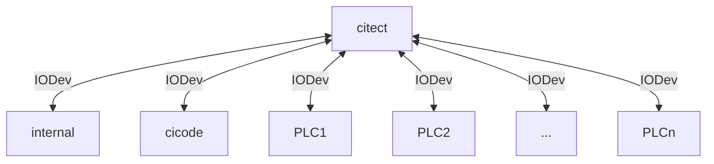
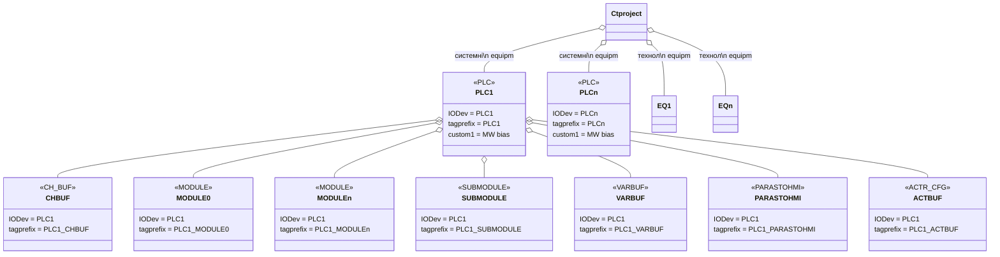
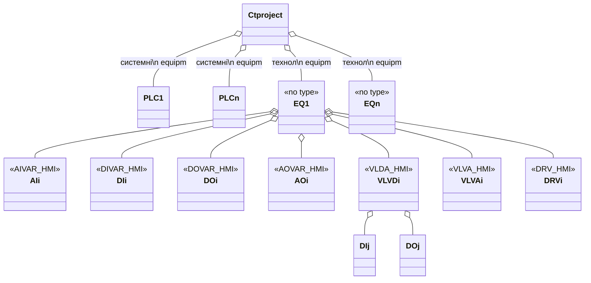

# Утиліти розгортання та роботи з Citect

Опис програми за [цим посиланням](citectprg.md).

## Перелік термінів

**PFW** - скорочена назва PACFramework

**PFWToola** - скорочена назва PACFramework Tools

**Змінні ПЛК** - об'єкти PFW з ПЛК, що передбачені для обміну зі SCADA/HMI  

**Системні змінні ПЛК** - змінні ПЛК, що виконують сервісні функції, зокрема:

- змінна PLC
- буферні змінні: CHBUF, VARBUF, ACTBUF, PRCBUF
- змінні для PLCMAP: MODULES, SUBMODULE
- PARASTOHMI

**Технологічні змінні ПЛК** - усі змінні ПЛК (PFW) що не є системними

## Перелік утиліт

- `citectcreateeqip <plcname>` - створення всього обладнання з експортного варіанту Unity для вказаного ПЛК
- `citectcreatemoduleeqip <plcname>` - створення обладнання системних змінних та LVL0 з експортного варіанту Unity для вказаного ПЛК
- `citectcreateacteqip <plcname>` - створення обладнання ВМ з експортного варіанту Unity для вказаного ПЛК
- `citectcreatevareqip <plcname>` - створення обладнання змінних з експортного варіанту Unity для вказаного ПЛК
- citectcreatehmi - створення джинів для всього обладнання каркасу
- citectcreatevarhmi -  створення джинів налагодження для технологічних змінних
- citectcreateplcmaphmi - створення джинів налагодження для карти ПЛК
- citectcreateacthmi - створення джинів налагодження для ВМ

Якщо `<plcname>` не вказується буде проводитися дія з усіма вказаними PLC в конфігурації 

## Загальні принципи

Перед запуском утиліт необхідно:

- сконфігурувати необхідні параметри в `config.ini` (див. нижче)
- створити проект на базі SA
- включити в проект `SA_LibraryPFW` який попередньо завантажити з [репозиторію](https://github.com/pupenasan/PACFramework/blob/master/platforms/citectsa/SA_LibraryPFW.ctz) і добавити в робочий простір
- створіть одного користувача з правами (на базі ролі) адміністратора
- створити необхідні IODevices
- експортувати проекти необхідних ПЛК в форматі `.xef` в ресурсну папку 

Приклад розгортання наведений [за цим посиланням](https://github.com/pupenasan/PACFramework/blob/master/platforms/citectsa/deployex2.md).

Утиліти мовно діляться на дві групи:

- створення Equipment
- створення графічної частини 

Перші базуються на імпорті необхідної інформації PACFramework з файлу `.xef`. Другі використовують вже готові Equipment та теги для формування графічної частини. Тому перед запуском утиліт формування графічної частини необхідно оновлювати сформовані теги (Update Equipment).   

## Налаштування CFG

Нижче наведений приклад налаштування `config.ini`

```ini
[citecttools]
plcsourcepath = C:\Users\OleksandrPupena\pacframeworktools\source; місце для xlst 
pathresult = C:\Users\OleksandrPupena\pacframeworktools\result ; місце для проміжних файлів 
pathlog = C:\Users\OleksandrPupena\pacframeworktools\log
pathmasterdbf = C:\ProgramData\AVEVA Plant SCADA 2020 R2\User
ctprojectname = ExamplePFW_depl
pfwincludename = SA_LibraryPFW
;iodevicename = PLC1, PLC2; ; перелік IODeviceName
cntelemetspergenie = dicnt:8,docnt:8,aicnt:4,aocnt:4 ;кількість елементів на кожен джин
cntactspergenie = 7; кількість ВМ на кожен джин
fpcontentforequipments = {"AIVAR_HMI":"FP_AI", "":""};{"eqtype":"FP"}
eqspacenaming = hierarchical; розбиття на Equipment за _

; для кожного ПЛК свій підрозділ
[citecttools.plc1]
xeffile = plc1 ; plc1.xef
iodevicename = PLC1 ;IODeviceName
EQprefix = Cell1

[citecttools.plc2]
xeffile = plc2 ; plc2.xef
iodevicename = PLC2
EQprefix = Cell2
```

Усі налаштування знаходяться в розділі та підрозділах `citecttools`: 

- `[citecttools]` - загальні налаштування
- `[citecttools.plcname]`  - налаштування для окремих PLC.  `plcname` може бути довільним але унікальним іменем, важливі назви параметрів та їх значення.

## Робота з Equipment

- citectcreateeqip - створення всього обладнання з експортного варіанту Unity
- citectcreateacteqip - створення обладнання ВМ з експортного варіанту Unity

### IODevices 



рис.1. Представлення структури IODevices 

### Загальні принципи формування Equipment

#### tagprefix

Для формування бази даних Equipment в PFWTools використовується `tagprefix`, як унікальний ідентифікатор Equipment. Тобто якщо у Equipment зміниться назва, але не зміниться  `tagprefix`, при запуску утиліт роботи з БД, будуть змінені існуючі Equipment з вказаним `tagprefix`. Значення `tagprefix` формується для кожної змінної, що імпортується. Він базується на назві цієї змінної в проекті ПЛК. 

- Усі змінні, що відносяться до системних мають бути унікальними для всього проекту SCADA, але є однаковими для кожного ПЛК. Тому ці змінні Equipment отримують префікс, який формується за правилом:  

```
IOdevice_plcvarname 
```

- Технологічні змінні (CM LVL1, CM LVL2, інші EQ) можуть передбачати унікальність в межах усіх ПЛК. Тобто в кожному ПЛК назва в ієрархії може включати префікс, що вказує на місце установки. Рекомендації щодо найменування можна почитати за [цим посиланням](https://github.com/pupenasan/PACFramework/blob/master/base/1_5_naming.md).  Якщо ж унікальність досягається тільки в межах одного ПЛК, аналогічно до системних Equipment  необхідно формувати додатковий префікс. Цей префікс може відрізнятися від імені IOdevice, так як має технологічну природу. Тому він задається для кожного ПЛК в налаштуваннях CFG як `EQprefix`. Якщо префікс не заданий, або порожній, то він не використовується. Якщо для жодного ПЛК не буде вказано `EQprefix` - це значить, що всі технологічні Equipment унікальні в межах віх ПЛК проекту SCADA.

#### Equipment Name

Назва Equipment вказує на приналежність в ієрархії. Утиліти  PFWTools намагатимуться автоматично формувати їєрархію відповідно до рівня змінної в ПЛК та її назви. Для цього використовуються ряд правил:

- верхнім рівнем ієрархії для системних змінних є назва проекту (корінь)
- верхнім рівнем ієрархії для технологічних змінних є значення `EQprefix` для того ПЛК, звідки береться змінна; якщо `EQprefix` не вказано верхнім рівнем за замовченням стає значення `Plant` 
- якщо змінна LVL1 є частиною LVL2, то вона буде за замовчуванням розміщуватися ієрархічно під  LVL2. 

- утиліти  PFWTools передбачають два способи автоматичного формуванні останньої (правої) частини ієрархічного імені; в залежності від налаштування опції `eqspacenaming` остання частина імені буде формуватися наступним чином: 
  - `hierarchical` - буде розбивати ім'я змінної на частини Equipment, використовуючи `_`; це значення за замовченням;
  - `flat` - повторюватиме ім'я змінної в ПЛК `plcvarname`

У будь якому випадку, розробник зможе після розгортання змінити найменування та ієрархію обладнання. Оскільки ідентифікація Equipment йде за `tagprefix` при повторному розгортанню розміщення змінюватися не буде. 

### Системні Equipment

Системна частина (LVL0 та буферні змінні) формується автоматично за назвою PLC.



рис.2. Представлення ієрархії Equipment - системна частина 

### Технологічні Equipment

Технологічна частина (CM LVL1, CM LVL2, інші EQ) автоматично формується з урахуванням вказаного в налаштуваннях конфігурації префіксу для ПЛК, наприклад `PLC1.EQprefix`. Якщо префікс не вказано (`EQprefix=''`) для жодного ПЛК, префікси тегів мають бути унікальними в межах усього проекту (усіх ПЛК). На рисунку нижче наведена ієрархія технологічних Equipment, в якій якщо немає жодного префіксу буде за замовченням тільки один Equipment верхнього рівня - `EQn`.  Якщо EQprefix не порожній, Tagprefix для Equipment технологічного рівня буде формуватися за шаблоном:   

```
EQprefix_plcvarname    
```

 



рис.3. Представлення ієрархії Equipment - технологічна частина 
