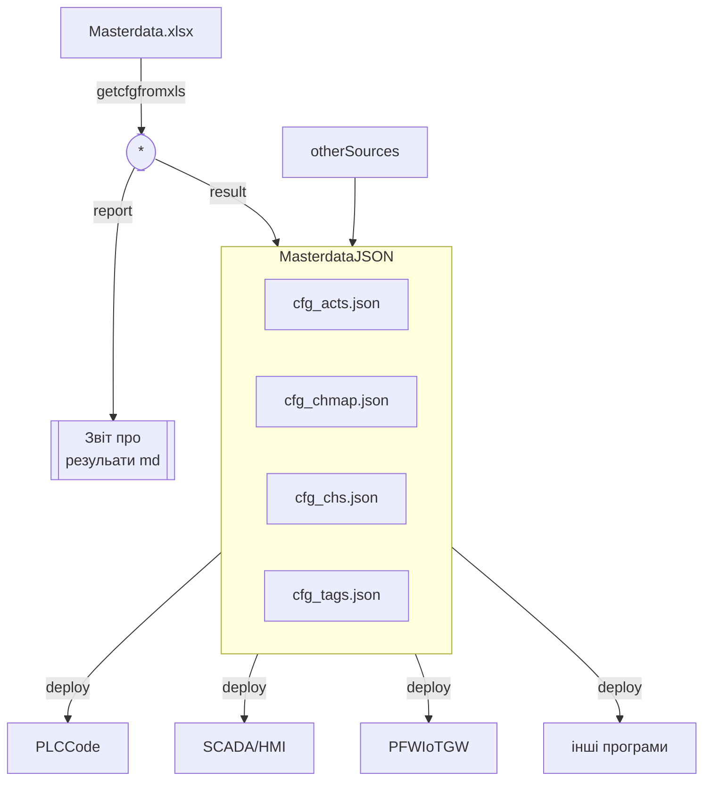
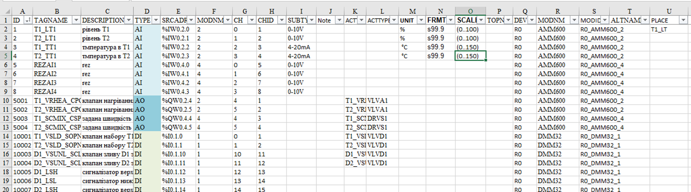
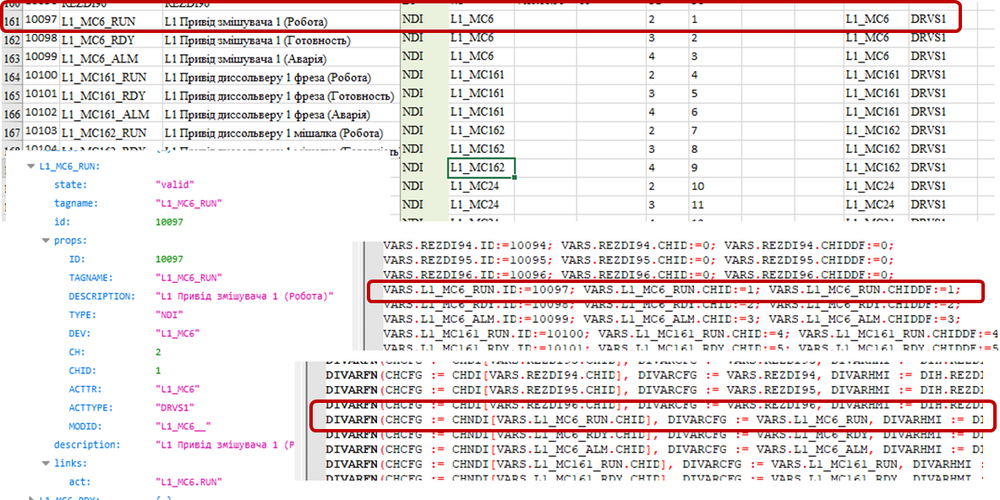
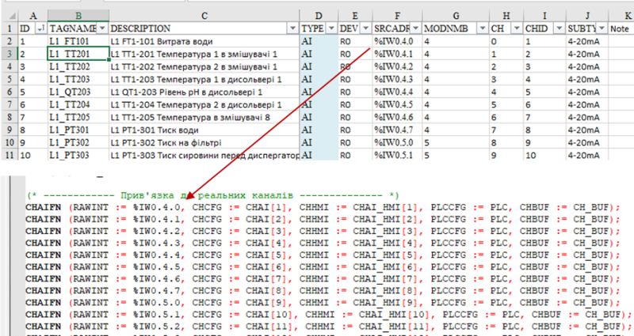
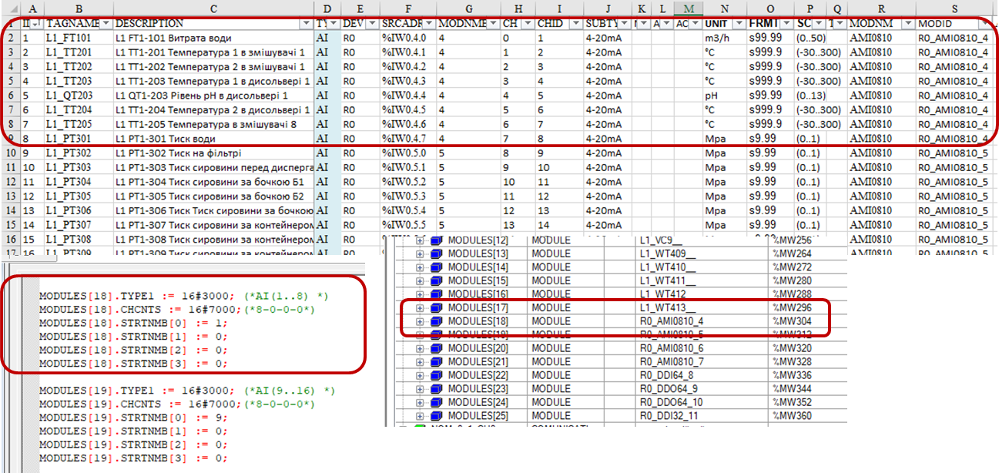
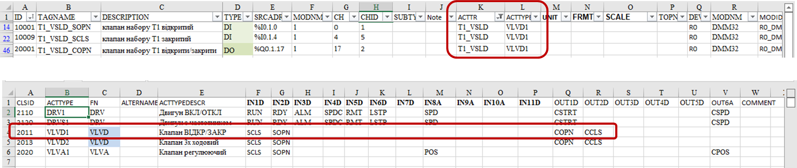
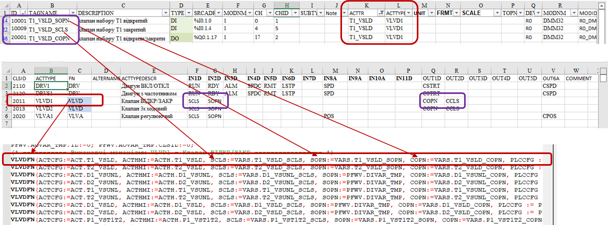
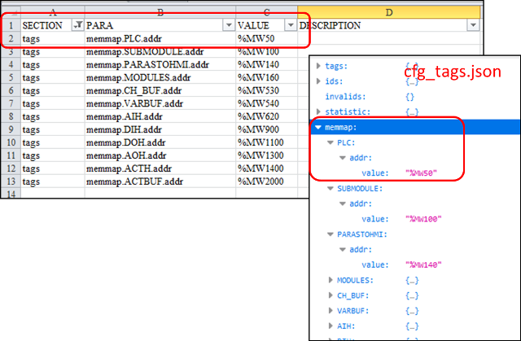
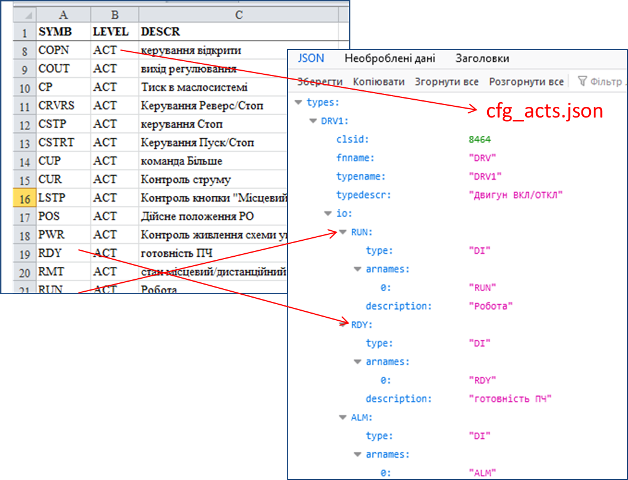

[PACFramework tools](README.md)

# Отримання даних з XLSX

## Про Майстердані

Майстердані зрештою зберігаються у форматі JSON, саме звідти відбуваються інші перетворення. Усі утиліти, що користуються майстерданими спочатку за замовченням перетворюють ресурсний файл XLSX в JSON, а потім у потрібні файли. Тим не менше утиліти можна запускати незалежно, наприклад для перевірки майстерданих до моменту їх використання у інших місцях.

У цьому документі опис правил заповнення XLSX, для ознайомлення з форматом БД в JSON прочитайте [цей документ](masterdataJSON.md). 

## Перелік утиліт

- `getcfgfromxls` -  призначена для перетворення даних з Excel в JSON. Цією утилітою також користуються інші утиліти. Результат перетворення (файли JSON) знаходиться в папці проекту `result`.  Крім JSON файлів формуються звіти в папці `report`




## Формат сторінок masterdata.xlsx

Файл  `masterdata.xlsx` (може бути інша назва) призначений для заповнення даних для проекту у формі таблиці. Файл перед запуском утиліт, що користуються цими даними треба розмістити в папку проекту  `source`.  

Приклад файлу masterdata для Unity PRO можна подивитися за [цим посиланням](https://docs.google.com/spreadsheets/d/1GvttNOH74X2o9y0fh_qxQCHhfdFszx7m/edit?usp=sharing&ouid=111751208742846482260&rtpof=true&sd=true). Для утиліт роботи з XLSX немає значення формати адресації, тому формат є платформо-незалежним. Якщо в проекті передбачається кілька ПЛК, для кожного з них має бути свій файл Masterdata.

Рекомендується використовувати фільтри та умовне форматування для зручності заповнення.

Файл містить наступні листи:

- `tags` - перелік технологічних змінних, їх прив'язки до каналів, налаштування каналів, прив'язки до ВМ, налаштування ВМ та ін
- `acttps` - містить шаблон означення ВМ
- `clsid` - містить номера CLSID для поіменованих в таблиці типів 
- `other` - для отримання інформації про інші налаштування в форматі JSON
- `symbid` - для отримання опису, який буде назначатися для входу/виходу функцінального блоку за його назвою
- може містити інші листи для своїх цілей  
- `stat` - може використовуватися для проміжного виведення певних статистичних даних, для утиліт PFwTools не використовується

Файл парситься скриптами і за ним формуються файли JSON та за необхідності документ в CouchDB.

Приклад формату файлу наведений [за посиланням](https://docs.google.com/spreadsheets/d/1GvttNOH74X2o9y0fh_qxQCHhfdFszx7m/edit?usp=sharing&ouid=111751208742846482260&rtpof=true&sd=true) 

### Лист tags

Даний лист містить перелік [технологічних змінних](https://pupenasan.github.io/PACFramework/base/1_3_equip.html) та всіх налаштувань асоційованих до них каналів та ВМ.



Таблиця може містити додаткові поля, це ніяк не вплине на роботу скриптів. Деякі з наведених полів можуть бути не задіяні в скрипті. Усі поля будуть переведені в формат JSON, як властивості `props` конкретного тега.

Зв'язка `технологічна змінна <-> канал` є проектною за замовченням і може бути зміненою під час налагодження в самому ПЛК. Каркас передбачає, що у будь який момент часу прив'язку змінної до каналу за замовченням можна повернути. 

**Перелік технологічних змінних, що передбачається прив'язувати до каналів повинен дорівнювати кількості каналів!**  Тобто, якщо канал в проекті резервний, необхідно створювати технологічні змінні з назвами типу `REZDI1`, як це описано в [рекомендацій до найменування змінних в каркасі](https://github.com/pupenasan/PACFramework/blob/master/base/1_5_naming.md). Таким чином в листі буде весь бюджет каналів, що дозволить простіше вносити зміни в програму. 

Усі налаштування CM для усіх рівнів асоціюються з технологічними змінними, саме їх ідентифікація є базовою. Якщо біля назви поля в описі нижче в дужках стоїть "необов'язкове" його можна не заповнювати в усіх інших випадках поле є обов'язковим.

Послідовність полів (колонок) має значення тільки для роботи формул всередині Excel. Для утиліти послідовність немає значення, **тоді як назва полів (колонок) - має**! 

#### Поля для технологічної змінної

`ID` - унікальний ідентифікатор технологічної змінної. Рекомендується давати в діапазонах, наприклад: 

- 1...4999 - AI/NAI
- 5000...5999 - AO/NAO
- 10001...19999 - DI/NDI
- 20000..29999 - DO/NDO   	

Рекомендується не розділяти діапазон ідентифікаторів для звичайних та мережних змінних так як це негативно вплине на деякі налаштування розгортання.

`TAGNAME` - унікальне ім'я технологічної змінної. Слід зауважити що дотримання [рекомендацій до найменування змінних в каркасі](https://github.com/pupenasan/PACFramework/blob/master/base/1_5_naming.md) для роботи утиліт мають велике значення, так як за суфіксами відбувається пошук привязки технологічних змінних до інтерфейсу ВМ(ACT). 

`DESCRIPTION` - опис технологічної змінної. При формуванні опису для `ACT` варто вказувати призначення в дужках, тоді при автоматичному формуванні переліку ВМ буде вибрана назва, що без дужок. Не дозволяється:

- використовувати символи `"`, `'`, `*` так як скрипти з ними не будуть працювати 

`TYPE` - тип (клас) технологічної змінної: 

- AI - AIVAR
- DI - DIVAR
- AO - AOVAR
- DO - DOVAR
- NAI - Network AIVAR (підклас)
- NAO - Network AOVAR (підклас)
- NDI - Network DIVAR (підклас)
- NDO - Network DOVAR (підклас)	

`CHID` - ідентифікатор каналу, до якого прив'язана змінна за замовченням. Для всіх наведених вище `TYPE` ставиться унікальний номер, який буде індексом у відповідному масиві.



`UNIT` (не обов'язкове) - інженерні одиниці, може бути використаним при наступному розгортанні в SCADA/HMI (див відповідний розділ)

`FRMT` (не обов'язкове) - формат відображення, може бути використаним при наступному розгортанні в SCADA/HMI (див відповідний розділ)		

`SCALE` (не обов'язкове) - налаштування масштабування для аналогових величин; якщо заповнюється, то задається у форматі `(min..max)` , наприклад `(0..100)`. Виставляється у відповідних полях змінних ПЛК за замовченням.	

`ALTNAME` (не обов'язкове) - альтернативне позначення технологічної змінної, наприклад яке використовується в інших схемах    

#### Поля для каналу

`SRCADR` - адреса змінної каналу в ПЛК, використовується для майстерданих каналу, а не технологічної змінної. Зокрема адреса використовується при генеруванні коду прив'язки каналів до вводу/виводу. Дана адреса задається в тому форматі, який потрібен для ПЛК. Наприклад:

  


`MODNMB` - номер модулю в пристроях, острову або шасі, де знаходиться канал. Використовується в генеруванні коду та структури карти каналів, як номер модуля. Упорядкування модулів в PLCMAP відбувається спочатку по назві пристрою (по алфавіту), а потім по номеру модуля в пристрої/острові.  	

`CH` - номер каналу в модулі, відповідно до нумерації модуля. Нумерація завжди починається з 0, якщо в модулі вказаний номер не з 0, усі інші канали вважатимуться відсутніми в підмодулі. 	

`SUBTYPE` (не обов'язкове) - підтип каналу, за яким буде формуватися CLSID; CLSID для каналу визначається за полем `TYPE` та `SUBTYPE` за вказаними на листі `CLSID` ідентифікаторами. Якщо підтип не вказаний береться як `deflt`  

`DEV` - назва пристрою або острову або шасі, де знаходиться модуль з каналом. Упорядкування модулів в PLCMAP відбувається спочатку по назві пристрою (по алфавіту), а потім по номеру модуля в пристрої/острові.   		 

`MODNM`  - символьне ім'я модуля на пристрої шасі або острові 

`MODID` - повна символьна назва модуля в системі, може формуватися за назвою `DEV` + `MODNM` + `MODNMB`  



#### Поля для виконавчого механізму

Наведені поля вказуються в тому випадку, якщо технологічна змінна є частиною ВМ (ACT). У цьому випадку, вона буде використовуватися при генеруванні структур та коду для ВМ.  	 	

`ACTTR` - назва ВМ або іншого комплексного засобу, в якому використовується змінна	

`ACTTYPE` - назва типу ВМ або іншого комплексного засобу, в якому використовується змінна. Тип повинен бути наведений на закладці `acttps`

`TOPN` - час спрацювання для ВМ в 0.1 секундах (не обов'язкове). Потрібне для заповнення відповідного поля в структурі відповідних змінних ПЛК за замовченням. 	



#### Загальні поля

`Note` - будь які примітки (не обов'язкове) . Сюди рекомендується писати робочі нотатки, зокрема які відбулися зміни і ким, питання до розробника і т.п.  

`PLACE` - розміщення на схемі або схемах (не обов'язкове)

### Лист acttps

На цьому листі вказуються налаштування типів виконавчих механізмів. На базі цих налаштувань генеруються функції виклику та створюються змінні. 

`CLSID` - ідентифікатор класу ВМ в 16-ковому вигляді	

`ACTTYPE`- тип ВМ, що вказаний в `ACTTYPE` по якому відбувається пошук типу

`FN` - функція/функціональний блок, що реалізовує обробку ВМ 	

`ALTERNAME` (не обов'язково) - альтернативне ім'я типу 	

`ACTTYPEDESCR` (не обов'язково) - опис типу	

`COMMENT` - додаткове поле для будь якого коментару

Наведені нижче поля відповідають за INOUT функції/функціонального блоку, що пов'язані з технологічними змінними. Якщо поле заповнене, то це використовується як назва входу/виходу, а також як суфікс технологічної змінної. Якщо для технологічної змінної вказаний ВМ, то її суфікс буде використаний для пошуку відповідного входу. Якщо варіантів таких суфіксів кілька, вони вказуються через `/`, але при цьому лівий текст буде відповідати за назву INOUT. Кількість таких полів в таблиці може бути зміненим за необхідності, але назви їх повинні бути за вказаним форматом.  

`IN1D..INxD` - для DIVAR

`IN8A..INyA` - для AIVAR

`OUT1D..OUTxD` - для DOVAR

`OUT6A..OUTxA` - для AOVAR



### Лист clsid

Тут налаштовуються CLSID для відповідних типів `TYPE` та підтипів `SUBTYPE`. Зокрема для каналів можуть бути такі налаштування:

| TYPE | SUBTYPE | CLSID   | DESCR                 |
| ---- | ------- | ------- | --------------------- |
| DI   | deflt   | 16#0010 | DI без означення типу |
| DO   | deflt   | 16#0020 | DO без означення типу |
| AI   | deflt   | 16#0030 | AI без означення типу |
| AI   | 4-20mA  | 16#0031 | AI струмовий 4-20 мА  |
| AI   | 0-20mA  | 16#0032 | AI струмовий 0-20 мА  |
| AI   | 0-10V   | 16#0033 | AI напргуа 0-10 В     |
| AI   | TR      | 16#0034 | AI термометр опору    |
| AI   | TC      | 16#0035 | AI термопара          |
| AO   | deflt   | 16#0040 | AO без означення типу |
| AO   | 4-20mA  | 16#0041 | AO струмовий 4-20 мА  |
| AO   | 0-20mA  | 16#0042 | AO струмовий 0-20 мА  |
| AO   | 0-10V   | 16#0043 | AO напргуа 0-10 В     |
| NDI  | deflt   | 16#0060 | DI без означення типу |
| NDO  | deflt   | 16#0070 | DO без означення типу |
| NAI  | deflt   | 16#0080 | AI без означення типу |
| NAO  | deflt   | 16#0090 | AO без означення типу |

Дана інформація може вказуватися для конкретних каналів при розгортанні.

### Лист other

Тут наводиться інформація, яка повинна бути записана в masterdata, але не міститься на інших закладках.

Ці дані записуються в наступні колонки за правилом: 

- `SECTION` - назва JSON файлу, куди повинні записуватися дані, але без вказівки префікса `cfg_`: може приймати значення `tags`, `chs`, `chmap`, `acts`  
- `PARA` - об'єкт у файлі в форматі вкладеності, типу `ob1.ob2.ob3` 
- `VALUE` - значення об'єкту 



### Лист symbid

Тут наводяться описи для входів/виходів функціональних блоків за їх символьним ідентифікатором. Це потрібно для генерування підказок щодо входів/виходів наприклад в IoTGateway.

- `SYMB` - символьна назва входу/виходу 
- `LEVEL` - підрівень CM
- `DESCR` - опис



## Налаштування ini

```ini
[exceltools]
pathsource = C:\Users\OleksandrPupena\pacframeworktools\source1 ; папка розміщення ресурсів
pathresult = C:\Users\OleksandrPupena\pacframeworktools\result1 ; папка розміщення результатів
pathlog = C:\Users\OleksandrPupena\pacframeworktools\log1 ; папка розміщення журналу
pathxlsfile = masterdata.xlsx ; файл xlsx
```

## Приклад getcfgfromxls

```bash
E:\san\PLCFramework\pacframework-tools\gitver>node index getcfgfromxls
23:35:32.503 -------------------- Отримання мастерданих про теги з Excel
23:35:32.653 Розбиваю записи по тегам
23:35:32.865 -------------------- Отримання мастерданих про ВМ з Excel та мастерданих тегів
23:35:32.937 Заповнюю інформацію ВМ з БД тегів
23:35:32.939 Укомплектовую структуру ВМ
Створив директорію C:\Users\OleksandrPupena\pacframeworktools\result1
23:35:32.988 Файл C:\Users\OleksandrPupena\pacframeworktools\result1/cfg_tags.json записано
23:35:32.990 Файл C:\Users\OleksandrPupena\pacframeworktools\result1/cfg_chs.json записано
23:35:32.992 Файл C:\Users\OleksandrPupena\pacframeworktools\result1/cfg_acts.json записано
23:35:32.994 Файл C:\Users\OleksandrPupena\pacframeworktools\result1/cfg_chmap.json записано
23:35:32.999 Звіт записано
23:35:33.8 Звіт записано
```

